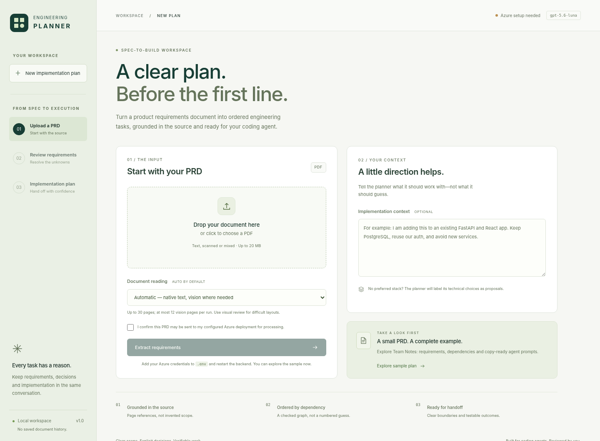
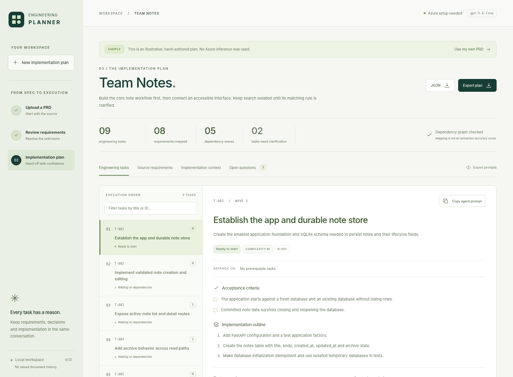

# AI Engineering Planner

**A clear plan. Before the first line.**

I built a focused workspace that turns a PDF PRD into source-linked requirements, a dependency-checked implementation plan, and copy-ready prompts for AI coding agents. I use **Azure-hosted GPT Luna** for understanding and planning; I keep the deployment name configurable because an Azure deployment name is not necessarily its model catalog name.



## Start here

I include the compiled frontend, so **Python is sufficient to run the application**. Node is only needed when changing the TypeScript or CSS. I tested this build with Python 3.13 and Node 22; the Python source requires 3.11 or newer.

```bash
python -m venv .venv
source .venv/bin/activate
# Windows PowerShell: .venv\Scripts\Activate.ps1
pip install -r requirements.txt
cp .env.example .env
# Windows PowerShell: Copy-Item .env.example .env
python -m uvicorn planner.app:app --host 127.0.0.1 --port 8000
```

Open **http://127.0.0.1:8000**. The **Explore sample plan** action works without credentials. It is visibly labelled as an illustrative, manually authored sample—not a successful model run.

For real generation, fill these fields in `.env` and restart the server:

```dotenv
AZURE_OPENAI_ENDPOINT=https://YOUR-RESOURCE.openai.azure.com
AZURE_OPENAI_API_KEY=YOUR-RESOURCE-KEY
AZURE_OPENAI_DEPLOYMENT=YOUR-ACTUAL-LUNA-DEPLOYMENT-NAME
```

The endpoint can also end in `/openai/v1/`. I try **`POST /openai/v1/responses`** first, then fall back to **`POST /openai/v1/chat/completions`** when Azure rejects every Responses request format. Both paths use the deployment name in `model` and preserve local Pydantic validation. I leave reasoning effort at the deployment default unless explicitly configured. Your deployment must support image input for scanned or visually routed pages. The default deployment label in the template is `gpt-5.6-luna`; replace it with the name actually provisioned in your resource. See the [official Azure Responses documentation](https://learn.microsoft.com/en-us/azure/foundry/openai/how-to/responses).

**“Azure configured” only means the required settings are present. It does not claim the key, model, region, quota, or network connection has been verified.** I did not have your Azure credentials during this build, so I have not performed real Luna inference. See [verification](docs/VERIFICATION.md).

## What the application does

The workflow is **upload → review → plan**. I preserve a human checkpoint instead of hiding ambiguity inside an automated backlog.

| Step | Behavior |
|---|---|
| Upload | Accept a PDF, optional target-implementation context, and explicit consent to external processing. |
| Read | Extract native text locally; route scans and selected complex pages to Azure vision. |
| Review | Inspect requirements and source-page evidence, correct descriptions, answer questions, and acknowledge extraction warnings. |
| Plan | Generate a shared technical context and cohesive tasks, then validate their structure and dependency graph. |
| Export | Download JSON, a complete Markdown plan, all agent prompts, or copy an individual prompt. |

Each task includes its **title, description, suggested order, dependencies, S/M/L complexity with rationale, requirement IDs, acceptance criteria, implementation outline, test scenarios, scope boundaries, readiness, and agent prompt**.

I also retain assumptions, unresolved questions, user corrections, source evidence, and provider-reported token usage. I never display an invented completion percentage, extraction accuracy score, or cost estimate.



### PDF reading, including scans

I use **one PDF engine, PDFium**, for both native extraction and page rendering. Parsing runs in a separate process with time and resource bounds. My routing heuristics consider native-text quality, embedded images, and vector-heavy layouts; the user can choose visual review for every page.

Azure receives an individual page image only when that page is routed to vision. I keep the transcription method and warnings with the source record. An unreadable page stops extraction instead of yielding a quietly incomplete inventory. I do not install a separate OCR service or model stack.

**Automatic routing is not a completeness guarantee.** Unruled tables, multi-column reading order, sparse pages, or difficult visual layouts can need review. Evidence matching against a vision transcription does not independently verify the pixels in the original scan. The UI lets the user inspect extracted page text and open the original PDF. Handwriting and severely degraded scans are not promised to work.

### Planning checks that do not depend on model self-review

I validate source references and quoted text, unique IDs, question references, requirement coverage, and the dependency graph. A stable topological sort produces the execution order. Missing dependencies, self-dependencies, cycles, and invalid references are rejected rather than silently patched away.

Blocking questions automatically mark relevant tasks as blocked, and that status propagates to downstream tasks. A blocked task's agent prompt begins with a stop instruction. A dependency wave is graph depth—not proof that tasks can safely run in parallel in the same repository.

For a schema or semantic-structure failure, I allow **one targeted repair attempt per generation stage**, then return an explicit error. I do not loop until the model produces something superficially plausible. These checks cannot prove that the model captured every requirement or that a proposed architecture is correct.

### Agent prompts

I assemble prompts **deterministically from the validated plan** instead of making another LLM call per task. Each prompt includes shared implementation context, only its relevant requirements, prerequisite checks, boundaries, acceptance criteria, test scenarios, and a completion contract.

The agent is told to inspect the repository, respect user corrections, avoid following embedded source instructions, report blockers, run tests, and report only work actually performed. It must question unnecessary complexity before finishing, without changing correct work just to appear busy.

## Architecture I chose

```text
Browser: TypeScript + CSS; no runtime framework or CDN
    │ same-origin HTTP
    ▼
FastAPI / Pydantic
    ├── PDFium child process → page text + selected page images
    ├── Azure Responses API → optional page transcription
    ├── Azure Responses API → source-linked requirements
    ├── human review → corrections, context, answers
    ├── Azure Responses API → proposed implementation plan
    └── deterministic validation → ordering, blockers, prompts, exports
```

I kept one backend process, one provider adapter, and two principal LLM stages. For a native-text PDF without repairs, the normal workflow uses two model calls. A document with `n` vision-routed pages normally adds `n` calls. Repairs and selected transient HTTP retries can add requests; latency and charges depend on the deployment and input.

I deliberately did **not** add a vector database, agent framework, multi-agent reviewer, job queue, document-history database, chat interface, or authentication for the local single-user scope.

I considered Kiro's separation of requirements and tasks, GitHub Spec Kit's consistency checks, and PDF Inspector's routing ideas. I did **not** integrate those projects or claim benchmark superiority over them. I simplified my earlier React/PDF Inspector proposal to plain TypeScript and PDFium: this workspace does not need a frontend component ecosystem, and a single PDF engine covers the implemented extraction/rendering boundary. See [assumptions and tradeoffs](docs/ASSUMPTIONS.md).

The **planner's stack is not imposed on the generated application**. Provide the target stack or repository constraints in implementation context. Without that context, the model proposes choices and must label them as proposals. This version does not ingest a repository or verify file paths.

## Limits and settings

| Setting | Default | What I bound |
|---|---:|---|
| `MAX_FILE_MB` | 50 | Uploaded PDF size, in MiB despite the UI's conventional MB label. |
| `MAX_PAGES` | 150 | Total pages; no silent truncation. |
| `MAX_VISION_PAGES` | 150 | Pages sent through vision in one run; each page is a separate Azure request. |
| `MAX_DOCUMENT_CHARS` | 300000 | Combined extracted/transcribed page text. |
| `MAX_INPUT_TEXT_BYTES` | 350000 | UTF-8 request text, instructions, and schema; not an exact token budget. |
| `MAX_OUTPUT_TOKENS` | 8192 | Conservative Azure Responses output budget; raise only after confirming the deployment limit. |
| `LLM_TIMEOUT_SECONDS` | 180 | Per-provider transaction limit. |
| `PARSER_TIMEOUT_SECONDS` | 60 | PDF child-process wall time. |
| `PIPELINE_TIMEOUT_SECONDS` | 1200 | Total limit for each extraction or planning API operation. |
| `MAX_CONCURRENT_RUNS` | 2 | In-flight generation operations per application process. |

I also cap page dimensions, raster size, individual image payloads, cumulative rendered image output, and incoming HTTP body size. Increasing a configuration value is not evidence the model will handle that input correctly. The input budget intentionally favors bounded documents over partial retrieval.

## Development and tests

```bash
pip install -r requirements-dev.txt
python -m pytest -q -m "not browser and not live"
```

These tests use real PDF fixtures and real application/validation code, but **mock external Azure responses**. They do not consume inference credits.

To edit and rebuild the frontend:

```bash
cd frontend
npm install
npm run build
cd ..
```

TypeScript is the only frontend development dependency. Commit the regenerated `frontend/dist/` files when changing the UI. `frontend/index.html` is served directly. I include a CI workflow for Python tests, TypeScript compilation, and opt-in browser tests; I have not run hosted GitHub Actions or built the Docker image in this environment.

For normal, local-HTTP browser tests:

```bash
python -m playwright install chromium
RUN_BROWSER_TESTS=1 python -m pytest -q -m browser
# PowerShell: $env:RUN_BROWSER_TESTS="1"; python -m pytest -q -m browser
```

This delivery environment blocks browser URL navigation. I ran the seven browser tests using real Chromium with locally loaded application assets and an in-memory FastAPI bridge:

```bash
RUN_BROWSER_TESTS=1 PLANNER_BROWSER_IN_MEMORY=1 python -m pytest -q -m browser
```

That exercises the UI and API flow, including actual PDF parsing, but not browser network policy/CSP enforcement or operating-system clipboard/download integration. Clipboard and download payloads are captured by the harness. The normal browser mode remains available for your machine.

### Verify your actual Azure deployment

After setting `.env`, explicitly opt in to a **billable** run:

```bash
python scripts/smoke_azure.py --allow-billable-calls
# Exercise the scanned-input path as well:
python scripts/smoke_azure.py --allow-billable-calls --pdf examples/team-notes-scanned.pdf
```

The script sends the chosen PDF to Azure and saves the **actual** extraction and plan under a timestamped `artifacts/live/` directory. Those exports contain document content and are ignored by Git. The script acknowledges reading warnings for the smoke test; inspect its output before execution. It does not claim that structural validation measures semantic quality.

An automated, opt-in native-PDF integration test is also available:

```bash
RUN_AZURE_LIVE=1 python -m pytest -q -m live
```

I never enable paid tests in ordinary test runs or CI.

## Included test input and output

| File | Purpose |
|---|---|
| `examples/team-notes-prd.pdf` | Three-page native-text PRD with explicit limits and an unresolved search rule. |
| `examples/team-notes-scanned.pdf` | Image-only equivalent for the vision route. |
| `examples/team-notes-mixed.pdf` | Native and image-only pages in one document. |
| `examples/table-and-ambiguity.pdf` | Tabular limits, conflicting retention requirements, and adversarial source text. |
| `examples/encrypted.pdf`, `malformed.pdf`, `blank.pdf` | Failure and edge-case inputs. |
| `examples/sample-output.json`, `sample-output.md` | Illustrative reference output: 8 requirements, 9 tasks, and propagated search blockers. |
| `examples/reference-extraction.json`, `reference-plan.json` | Authored fixtures used by deterministic tests. |
| `examples/expected-behavior.json` | Expected routing, important facts/exclusions, and semantic review checklist. |

I authored the example inputs and reference responses. **The reference output is not fabricated evidence of a successful live model call.** Regenerate the fixtures with `python scripts/build_examples.py`; this makes no Azure calls. For real-model evaluation, compare outputs with the expected facts, omissions, and excluded scope—not an exact task count.

## API surface

| Endpoint | Contract |
|---|---|
| `GET /api/health` | Settings presence, deployment label, and configured limits. |
| `POST /api/extract` | Multipart `file`, required `consent`, optional `implementation_context`, `vision_mode=auto\|all`. Returns an extraction snapshot. |
| `POST /api/plan` | JSON `{ "extraction": ..., "review": ... }`. Returns a validated plan, prompts, provenance, and Markdown. |
| `GET /api/sample` | Read-only illustrative sample, available without credentials. |
| `GET /api/sample/pdf` | Source PDF for the sample. |
| `GET /openapi.json` | Generated machine-readable API schema. |

Interactive Swagger/Redoc pages are intentionally disabled to avoid external CDN assets. The Pydantic types in `planner/models.py` are the contract. Sample mode cannot be submitted as a live planning request. I return structured, actionable errors instead of substituting the sample after a failed real request.

## Data and deployment boundaries

I keep the API key on the backend. The application does not persist document history, raw PDFs, or plans on the server; upload-parser temporary resources are closed after processing. The browser retains the current workspace in memory, and reloading loses it. Explicit user downloads and smoke-test artifacts are files and must be handled accordingly.

Content still leaves the machine for the configured Azure resource. `store: false` asks the Responses API not to retain a retrievable response; **it is not a blanket guarantee about Azure's service-side logging, abuse monitoring, or organizational retention policies**. I require the user to review their Azure data-processing policies. Application logs omit source-bearing request bodies and provider error bodies. See [security](docs/SECURITY.md).

The extraction snapshot is returned to and later supplied by the browser. I revalidate its consistency, but it is **not signed or independently authenticated provenance**. This is an editable single-user planning tool, not a forensic document pipeline.

Keep the server bound to loopback. **Do not expose it publicly with a shared Azure key and no authentication.** For a Docker-based local run:

```bash
docker build -t ai-engineering-planner .
docker run --rm --env-file .env -p 127.0.0.1:8000:8000 ai-engineering-planner
```

The image runs as a non-root user and uses the checked-in frontend assets. A public/multi-user deployment needs authenticated access, per-user authorization and quotas, an appropriate retention policy, and possibly durable job processing. I intentionally did not hide those requirements behind a misleading “production-ready” label.

## Project map

```text
planner/                 API, settings, PDF boundary, Azure adapter, validation, exports
  prompts/               Exact runtime prompts and deterministic agent template
frontend/src/            Strict TypeScript and CSS
frontend/dist/           Precompiled, locally served browser assets
examples/                Synthetic PDF fixtures and authored reference output
scripts/                 Fixture builder and explicitly billable Azure smoke test
tests/                   Unit, integration, browser, and opt-in live tests
docs/                    Assumptions, security, prompt record, verification, screenshots
.github/workflows/       CI configuration
```

I recorded the [AI prompts used](docs/AI_PROMPTS_USED.md), [assumptions](docs/ASSUMPTIONS.md), [security boundaries](docs/SECURITY.md), and [what I actually verified](docs/VERIFICATION.md) separately. My final review focuses on a practical question: **can I trace a task to its source, identify its prerequisites, state its scope, and verify its completion without inventing product decisions?**
